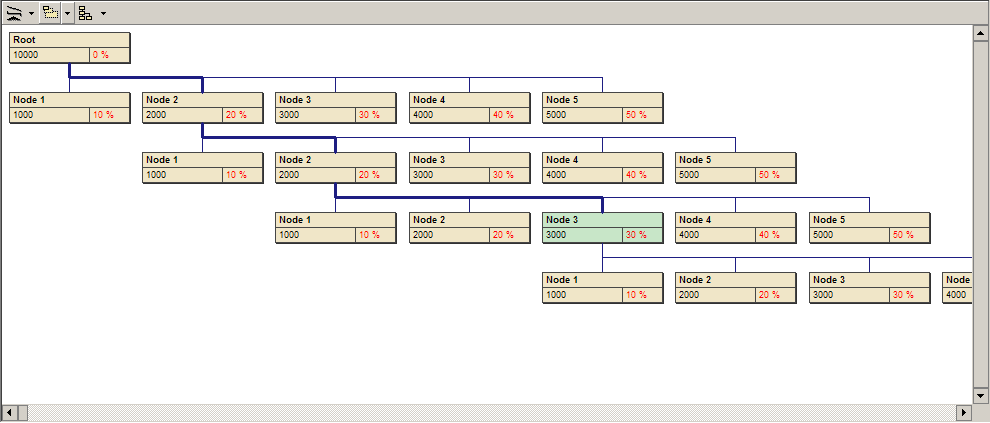



## SuperTree v1\.0\.7

### Description

Advanced Controls - SuperTree 1.0

 

NonStandard Tree based Data Browser, Customize your node look, and you can get really usefull non-standard hierarchical data browser.
 
### More Info
 

             |
---                |---
**Submitted On**   |2002-07-26 10:23:06
**By**             |[ORSHEE](https://github.com/Planet-Source-Code/PSCIndex/blob/master/ByAuthor/orshee.md)
**Level**          |Advanced
**User Rating**    |5.0 (144 globes from 29 users)
**Compatibility**  |VB 6\.0
**Category**       |[Custom Controls/ Forms/  Menus](https://github.com/Planet-Source-Code/PSCIndex/blob/master/ByCategory/custom-controls-forms-menus__1-4.md)
**World**          |[Visual Basic](https://github.com/Planet-Source-Code/PSCIndex/blob/master/ByWorld/visual-basic.md)
**Archive File**   |[SuperTree\_1108707262002\.zip](https://github.com/Planet-Source-Code/orshee-supertree-v1-0-7__1-37264/archive/master.zip)

